# MULTICAMPUS-heckerthon
**Hipdrobe 나만의 옷장** (`django`, `python`, `opencv`, j`avascript`)

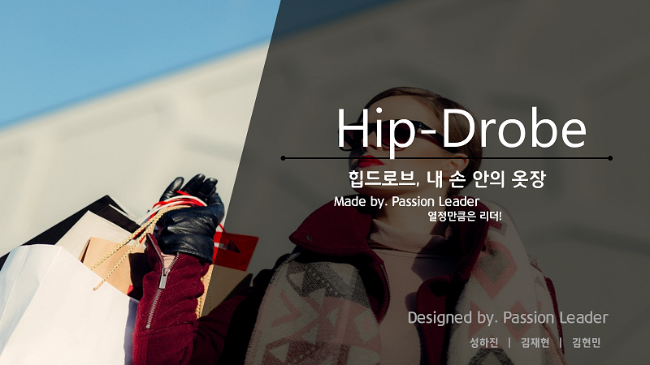

:link:[배포 URL](http://hipdrobe.herokuapp.com/)

:link:[프로젝트 프리젠테이션](assets/힙드로브%20프리젠테이션.pdf)

:link:[프로젝트 결과보고서](assets/종합프로젝트%20결과보고서-힙드로브(패션리더).pdf)

## Hipdrobe 프로젝트 개요

### 기획 동기

행거 하나에 걸린 옷들 만으로도 20종류 이상의 룩(look)을 선보이는 패션 크리에이터의 영상을 보고, 옷이 없어서 못 입었던 게 아니라 있는 옷들을 제대로 알지 못하고 알더라도 입을 줄 몰라서 옷을 못 입었을 수 있겠다고 생각이 들었다. 이러한 맥락에서 이용자가 자신의 옷을 한 눈에 파악할 수 있는 온라인 옷장이 있다면 가지고 있는 옷의 활용도가 높아지고, 나아가 직접 코디해 보면서 패션에 대한 어드바이스를 얻을 수 있으면 패알못을 탈출할 수 있을 것이라고 생각해,  ***‘힙드로브, 내 손 안의 옷장’***이라는 서비스를 기획하였다.

### 목표

`Django` 와 `Python`을 최대한 활용해 서비스를 구현하고, 론칭 전에 직접 서비스를 이용해 보면서 유저의 입장이 돼 서비스를 개선해 나가고, 최종적으로는 배포 후에 운영까지 해보는 것을 목표로 한다.

### 구성원 및 역할

|  이름  |     전공     |  역할   |                     구현 내역                     |
| :----: | :----------: | :-----: | :-----------------------------------------------: |
| 성하진 | 신문방송학과 | 팀장/PM |  ER Model 설계, My 옷장 페이지, 옷장 아이템 CRUD  |
| 김재현 |   물리학과   | 팀원/PL | 코디작성 페이지, 코디 작성 기능 및 CRUD , BG 제거 |
| 김현민 |  산업공학과  |  팀원   |   로그인/회원가입 페이지 및 기능 구현, 웹디자인   |

### 개발 일정

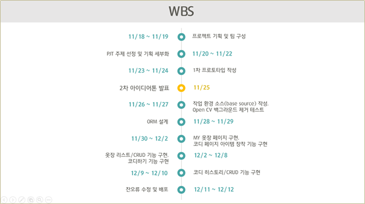

## 사용 기술

- Django Framework

  Backend Server Layer 구현

- OpenCV - background image remove (일부 자체구현)

  옷장 아이템 이미지 백그라운드 제거

- Drag & Drop library

  코디 작성 중 착용한 아이템을 원하는 위치로 조정

- DOM Element to Json, Json to DOM Element(자체 구현)

  javascript를 활용한 코디 포스트의 serialize 및 deserialize 코드

- ORM

  django의 기능을 최대한 활용한 편리한 DB 접근 및 제어

## 구현 내역

### Use Case

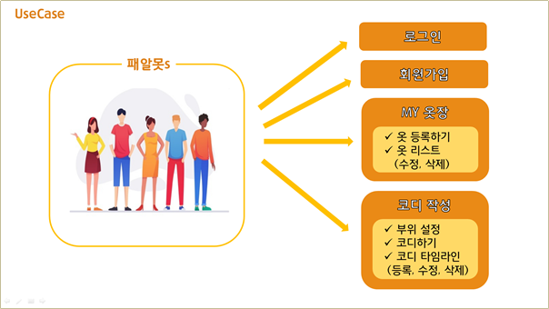

### ERD

> ※모식도에는 빠져있지만 Clothes 테이블도 User와 relation이 있음

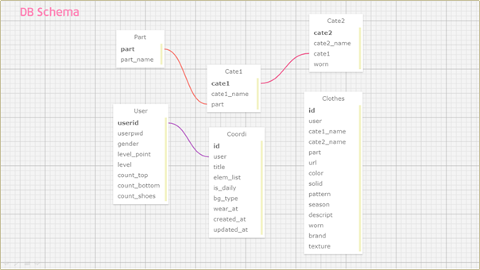

## 구현 된 UI 및 기능 소개

### 메인 페이지

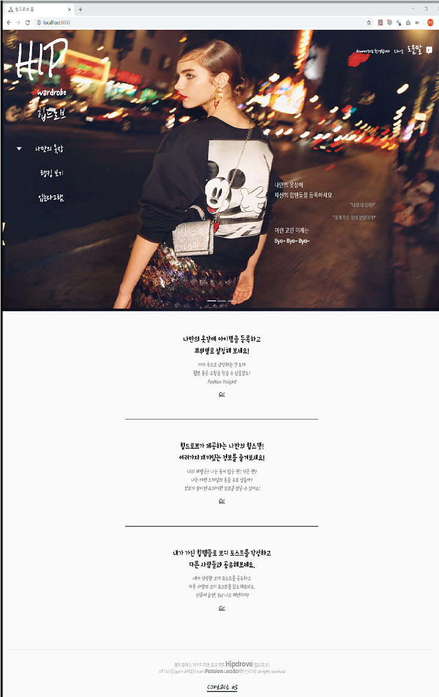

### 회원가입 페이지

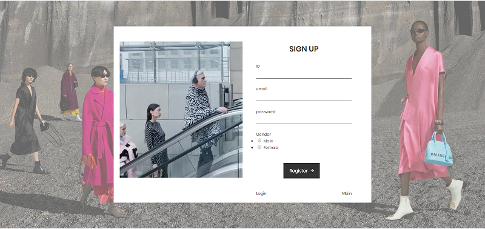

### 로그인 페이지

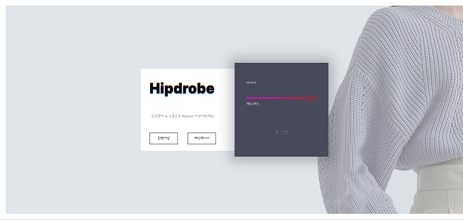

### My 옷장 페이지

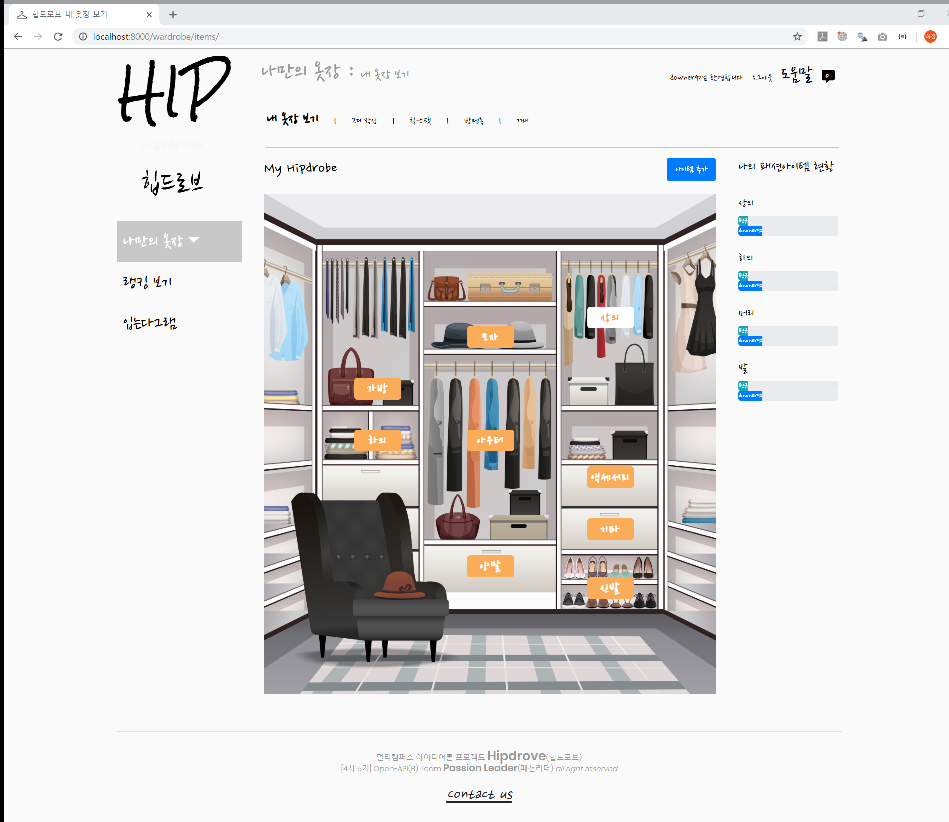

### My 옷장 - 아이템 리스트 모달

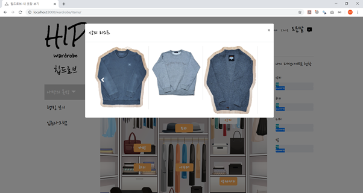

### 아이템 등록 - Categorizing

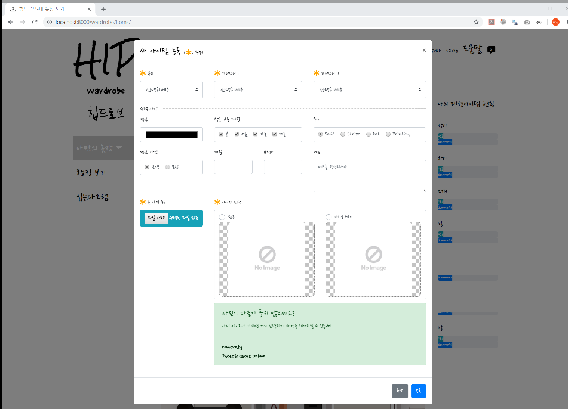

### 아이템 등록 - BG 제거

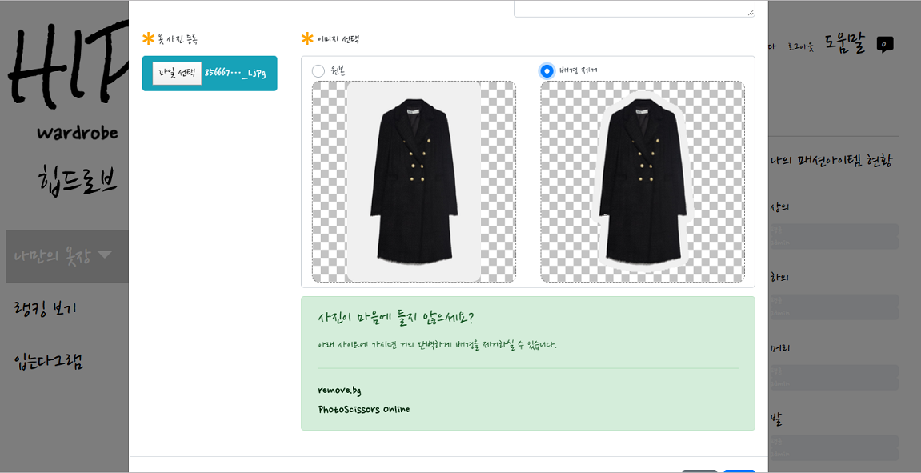

### 코디하기  - 부위 설정 

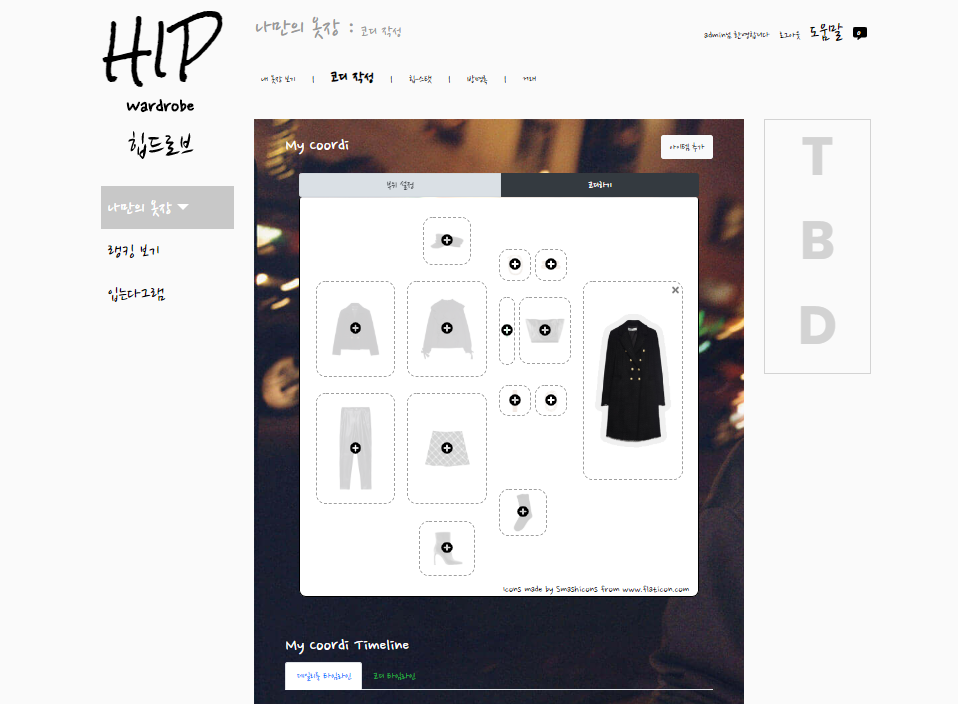

### 코디하기 - 코디 모드

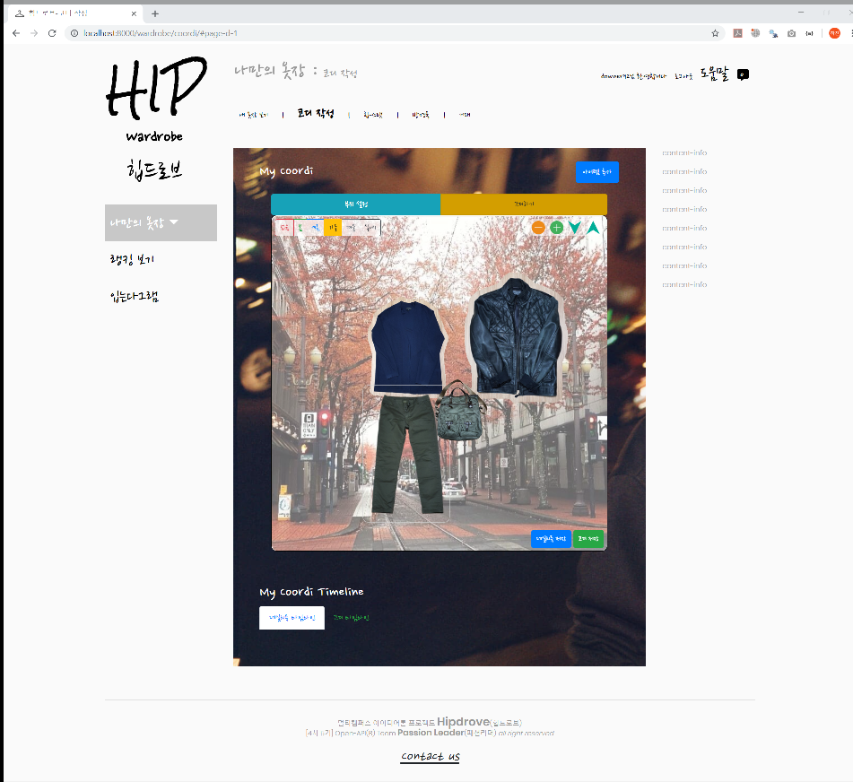

### 코디 히스토리

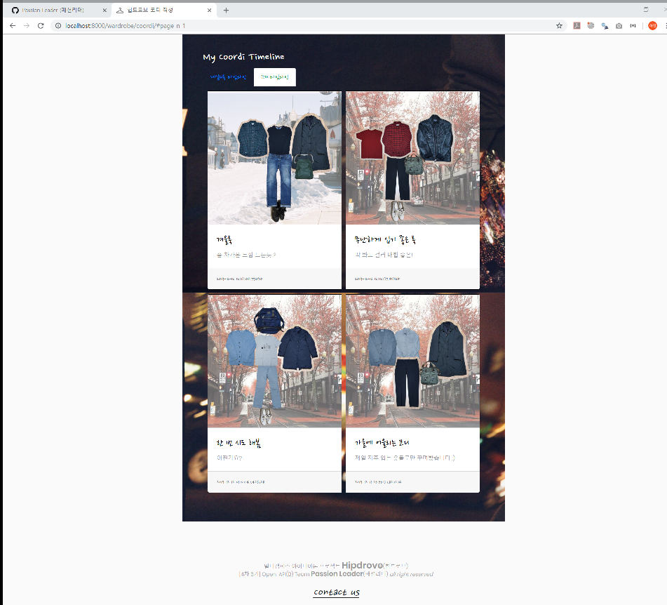

## 결과 및 수상 내역

멀티캠퍼스 4차산업혁명선도인력양성과정[4차5기] **Hackathon 프로젝트 우수상** (Open-API를 활용한 전처리/시각화 B반 1위)

## 기대 효과 및 보완점

### 기대 효과

- 옷을 옷장에 등록하는 행위를 통해 얻을 수 있는 기대 효과
  - 옷마다 좋아하거나 싫어하는 포인트를 되새겨 볼 수 있다.
  - 옷의 디테일을 발견할 수 있다.
  - 옷장에 박혀 있떤 안 입는 옷을 재발견 할 수 있다.
- 코디하기와 히스토리를 통해 얻을 수 있는 기대 효과
  - 옷을 입어봐야하는 불편함 없이 잘 어울리는 색 조합을 찾을 수 있다.
  - 데일리룩을 기록함으로써 어떤 옷을 자주 입는지 알 수 있다.
- 옷장 기능의 다양한 용도
  - 옷 설정에 옷마다 얽힌 스토리를 기록함으로써 과거를 추억할 수 있다.
  - 이미 구매한 옷을 저장해 놓으면 같은 옷을 구매하는 실수를 막을 수 있다.
  - 이 외에도 이용자에 따라 옷장을 다양한 용도로 이용할 수 있을 것으로 기대한다.

### 보완점

옷장에 옷을 등록하는 행위는 생각보다 번거로웠고, 이용자가 번거로움을 무릅쓰고서라도 서비스를 이용할 만한 메리트가 필요하다는 생각이 든다.

- 코디 어드바이스 기능 추가

  코디하기 페이지에서 이용자가 선택하는 옷의 대표색상을 추출하고, color combination 라이브러리를 활용해 대표색상과 가장 어울리는 조합의 대표색상을 가진 옷을 추천해주는 기능을 추가한다.

- 옷 종류별 세탁 방법 추가

  My 옷장 페이지에 옷 종류별 세탁 방법에 대한 div를 추가한다.

- 자주 입는 옷과 입지 않는 옷 보여주기

## 개발 후기

| 성명     | 후기                                                         |
| -------- | ------------------------------------------------------------ |
| 성 하 진 | 시간이 많이 부족해서 아쉬웠지만 역시 많은 것들을 배운 프로젝트였습니다. 공교롭게도 매 프로젝트마다 주로 사용한 언어가 달랐는데, 이번에는 웹 페이지 상에서 동적인 흐름이 중요했던 만큼 javascript를 가장 많이 사용해 볼 수 있었습니다. 덕분에 UX에 정말 많은 노력과 고생이 들어간다는 점을 깨달을 수 있었고 그 가치를 재발견할 수 있었습니다. 내공이 단단하신 형님께도 많이 배울 수 있어서 소중한 기회였습니다. 사소한 코드를 작성하더라도 실무에서는 어떤 식으로 작성해야 하는지 배울 수 있었고, 소스 코드도 사용해보면서 협업이 이루어지는 절차도 제대로 배울 수 있었습니다. |
| 김재현   | 아무리 단순한 아이디어로 시작한 프로젝트라도 실제로 사용자가 이용할 수 있는 서비스로 녹여내려면, 매우 많은 사항을 꼼꼼히 고려하고 상당한 양의 작업을 수행해야만 한다는 사실을 다시 한 번 실감했습니다. |
| 김현민   | 아이디어톤을 통해 막연한 아이디어가 점점 구체화되어 구현되는 것을 보며 잘 알려진 서비스들의 탄생 과정을 대략적으로 떠올릴 수 있었습니다. 또한, 협업도구와 처음 써보는 프레임워크를 활용하는 과정에서 웹 개발에 좀 더 친숙하게 다가갈 수 있던 계기가 되었습니다. 과거에는 떠오르는 아이디어를 흘려버렸다면, 이번 프로젝트를 계기로 아이디어를 소중히 생각하게 되었습니다 |

